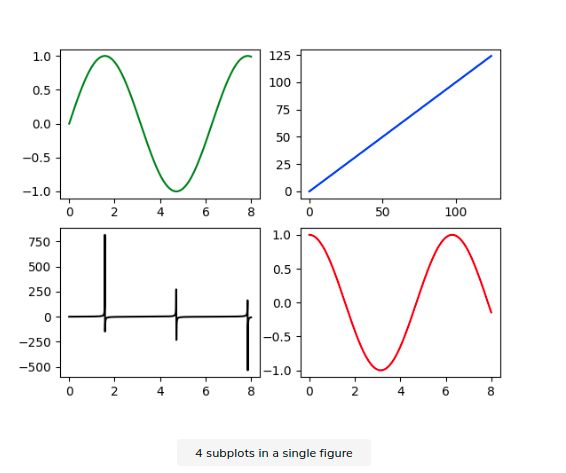

1. https://www.educative.io/edpresso/what-is-a-subplots-in-matplotlib

The matplotlib.pyplot.subplots method provides a way to plot multiple plots on a single figure. Given the number of rows and columns, it returns a tuple (fig, ax), giving a single figure fig with an array of axes ax.

**Return**

Here is an explanation of the tuple returned by the function:

fig: The matplotlib.pyplot.figure object to be used as a container for all the subplots.
ax: A single object of the axes.Axes object if there is only one plot, or an array of axes.Axes objects if there are multiple plots, as specified by the nrows and ncols.

**Example**

Here is an example on how to use the matplotlib.pyplot.subplots method:

Line 1-2: Import matplotlib.pyplot for plotting and numpy for generating data to plot.
Line 4: Generate a figure with 2 rows and 2 columns of subplots.
Line 5: Generate some data using numpy.
Line 7-10: Index the ax array to plot different subplots on the figure fig.
Line 11: Output the figure.

```
import matplotlib.pyplot as plt
import numpy as np

fig, ax = plt.subplots(2, 2)
x = np.linspace(0, 8, 1000)

ax[0, 0].plot(x, np.sin(x), 'g') #row=0, col=0
ax[1, 0].plot(x, np.tan(x), 'k') #row=1, col=0
ax[0, 1].plot(range(100), 'b') #row=0, col=1
ax[1, 1].plot(x, np.cos(x), 'r') #row=1, col=1
fig.show()
```



#### 2. Official - https://matplotlib.org/api/_as_gen/matplotlib.pyplot.subplots.html

Create a figure and a set of subplots.

This utility wrapper makes it convenient to create common layouts of subplots, including the enclosing figure object, in a single call.

#### 3. why-do-many-examples-use-fig-ax-plt-subplots-in-matplotlib

https://stackoverflow.com/questions/34162443/why-do-many-examples-use-fig-ax-plt-subplots-in-matplotlib-pyplot-python

`plt.subplots()` is a function that returns a tuple containing a figure and axes object(s). Thus when using `fig, ax = plt.subplots()` you unpack this tuple into the variables `fig` and `ax`. Having `fig` is useful if you want to change figure-level attributes or save the figure as an image file later (e.g. with `fig.savefig('yourfilename.png')`). You certainly don't have to use the returned figure object but many people do use it later so it's common to see. Also, all axes objects (the objects that have plotting methods), have a parent figure object anyway, thus:

    fig, ax = plt.subplots()

is more concise than this:

    fig = plt.figure()
    ax = fig.add_subplot(111)
