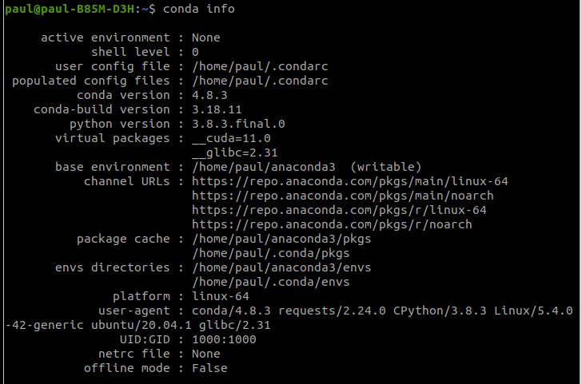
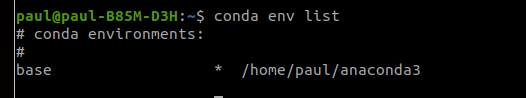

## Important commands

### General Basic Commands

You can run `conda info --envs`, and that will show the paths to all your environments.

#### Display Conda environment information

`conda info`

**List all existing environments**

`conda env list`

**Update conda to the current version**

`conda update conda`

### Environment management Related

**Create a new environment named py35, install Python 3.5**

`conda create --name py35 python=3.5`

**Activate the new environment to use it**

**For conda 4.6 and later versions.**

`conda activate` and `conda deactivate`

**For conda versions prior to 4.6, run:**

Windows: `activate` or `deactivate`

Linux and macOS: `source activate` or `source deactivate`

**Make exact copy / clone of an environment**

**conda create --clone py35 --name py35-2**

#### Downloading from specific Channel

When I run below to install [**jupyterlab/debugger**](https://github.com/jupyterlab/debugger)

`conda create -n jupyterlab-debugger -c conda-forge xeus-python=0.8.0 notebook=6 jupyterlab=2 ptvsd nodejs`

**In above the "-c" stands for channel - meaning with above command jupyterlab-debugger will be downloaded from conda-forge channel**

Then activate that with `conda activate jupyterlab-debugger`

Then, run the following command to install the extension:

`jupyter labextension install @jupyterlab/debugger`

### To delete or remove the environment, type the following in your terminal:

`conda remove --name env_name --all`

### Some more reference

https://conda.io/projects/conda/en/latest/commands.html
