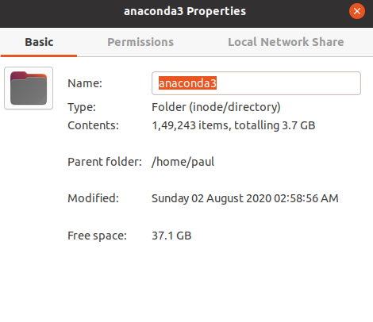

https://docs.conda.io/projects/conda/en/latest/user-guide/tasks/manage-environments.html?highlight=clone#cloning-an-environment

You can make an exact copy of an environment by creating a clone of it:

**`conda create --name myclone --clone myenv`**

Note - Replace myclone with the name of the new environment. Replace myenv with the name of the existing environment that you want to copy.

To verify that the copy was made:

`conda info --envs`

In the environments list that displays, you should see both the source environment and the new copy.

#### Does cloning takes up extra space ?

**My **`~/.anaconda3`** directory before running below command**

