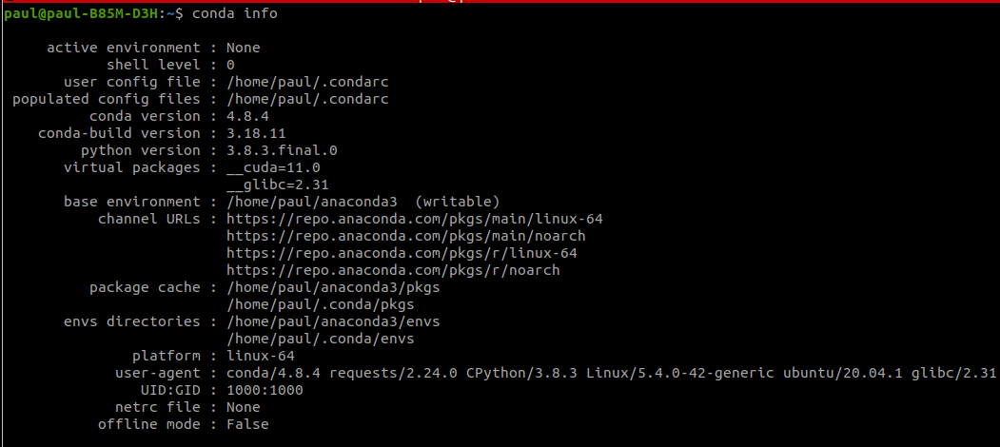

### What is an Environment

An environment is a way of starting with a new Python installation, that doesn't look at your already installed packages. In this way, it simulates having a fresh install of Python. If two applications require different versions of Python, you can simply create different environments for them. If you start from a fresh environment and install as you go, you are able to generate a list of all packages installed in the environment so that others can easily duplicate it.

There are few steps to using an environment (with a third step needed if you want to use Jupyter notebooks)

- Creating the environment, either from scratch (a new project) or from a yaml file (duplicating an environment)
- Activating the environment for use.
- Register the environment with Jupyter.
- To leave an environment, we have to deactivate it.

#### Anaconda Python: where are the virtual environments stored?

Simple Ans - Your environments are located in `**Anaconda3\envs\<yourEnv_directory>\**`

You can also run `conda info` which will give you details

**A key difference between the two tools is that conda has the ability to create isolated environments that can contain different versions of Python and/or the packages installed in them. This can be extremely useful when working with data science tools as different tools may contain conflicting requirements which could prevent them all being installed into a single environment. Pip has no built in support for environments but rather depends on other tools like virtualenv or venv to create isolated environments. Tools such as pipenv, poetry, and hatch wrap pip and virtualenv to provide a unified method for working with these environments.**

**Next to the root environment, you can create as many additional environments as you want. And the whole point is that these additional environments can contain different versions of Pythons and other packages. So it means that, for example, if your precious little application is not working anymore in the newest, state-of-the-art environment you’ve just set up, you can always go “back” and use some another version(s) of some packages (including Python – Python itself is a package**

https://www.anaconda.com/blog/understanding-conda-and-pip

https://docs.conda.io/projects/conda/en/latest/user-guide/tasks/manage-environments.html#:~:text=With%20conda%2C%20you%20can%20create,also%20share%20an%20environment%20file.

With conda, you can create, export, list, remove, and update environments that have different versions of Python and/or packages installed in them. Switching or moving between environments is called activating the environment. You can also share an environment file.

---

### create a Python virtual environment

`conda create --name env_name python=3.7`

The above line literally says: Create an environment using the conda create command whose name is env_name (you can choose any name) that runs on python=3.7

#### Command To Make exact copy of an environment

**conda create --clone py35 --name py35-2**

### Downloading from specific Channel while creating a new environment

When I run below to install [**jupyterlab/debugger**](https://github.com/jupyterlab/debugger)

`conda create -n jupyterlab-debugger -c conda-forge xeus-python=0.8.0 notebook=6 jupyterlab=2 ptvsd nodejs`

**In above the "-c" stands for channel - meaning with above command jupyterlab-debugger will be downloaded from conda-forge channel**

Then activate that with `conda activate jupyterlab-debugger`

Then, run the following command to install the extension:

`jupyter labextension install @jupyterlab/debugger`

---

### Activating my new environment

`conda activate` and `conda deactivate` only work on conda 4.6 and later versions. For conda versions prior to 4.6, run:

Windows: `activate` or `deactivate`

Linux and macOS: `source activate` or `source deactivate`

### Connecting my new environment with Jupyter

If you want Jupyter notebooks to see your new environment, you need a couple of extra instructions. Jupyter sees the different environments as different kernels. Once we create a new environment, we need to tell Jupyter that it is there:

**Note you'll want to do this in the new environment.**

**First we will need the ipykernel package**

**`(test_env) $ conda install ipykernel`**

This tells jupyter to take the current environment (test_env) and make a "kernel" option named "test kernel" in the kernel menu

**`(test_env) $ python -m ipykernel install --user --name myenv --display-name "test kernel"`**

---

### To delete or remove the environment, type the following in your terminal:

`conda remove --name env_name --all`

---

### Make my new environment exportable and usable by others

Now you want to make an environment.yaml file that will allow others to recreate the environment from scratch. To make this file, we use the export command and send the output to environment.yaml:

**while in test_env, export the packages used to an environment file**

**`(test_env) \$ conda env export > environment.yaml`**

Once we are done with the environment, we can deactivate and delete the environment:

**Leave the environment**

(test_env) \$ source deactivate

**Now we are no longer in test_env, we can delete it**

`$ conda env remove --name test_env`
