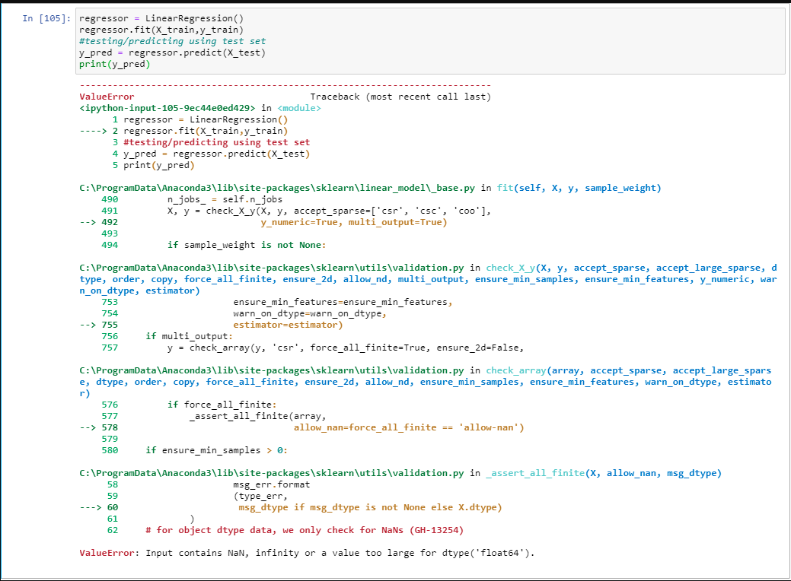

#### ValueError: Input contains NaN, infinity or a value too large for dtype('float64') in linear regression

```py
import pandas as pd
import numpy as np
housing = pd.read_csv('housing.csv')
X = housing.iloc[:, housing.columns !='median_house_value'].values
y = housing.iloc[:, 9].values
print(X[0])


housing.head()


from sklearn.datasets import fetch_california_housing
from sklearn.model_selection import train_test_split
from sklearn.preprocessing import StandardScaler
from sklearn.preprocessing import LabelEncoder, OneHotEncoder
from sklearn.compose import ColumnTransformer
from sklearn.linear_model import LinearRegression


labelencoder = LabelEncoder()
X[:, 8] = labelencoder.fit_transform(X[:, 8])


print(X[0])


X_train, X_test, y_train, y_test = train_test_split(X, y, test_size=0.2, random_state=0)


regressor = LinearRegression()
regressor.fit(X_train,y_train)
#testing/predicting using test set
y_pred = regressor.predict(X_test)
print(y_pred)

```

**i am getting error at regressor.fit() method.**



### To Resolve

It happening because there were some missing data, empty cells more accurate to say. Here is the Solution if you encounter such an error.

1. **Check for empty cells**.

   Run `dataframename.isnull().sum()` (replace **_dataframename_** with **_your dataframe name_** method to your dataframe.

   This will show you in which columns have empty or NaN cells.

2. **Remove Empty Cells**

   Run `dataframename = dataframename.dropna()` to remove empty cells.

   Check this site for more filters https://pandas.pydata.org/pandas-docs/stable/reference/api/pandas.DataFrame.dropna.html

3. **Confirm it**

   Run `dataframename.isnull().sum()` to check whether there are any empty cells.

Now continue with the actual work on the data.
