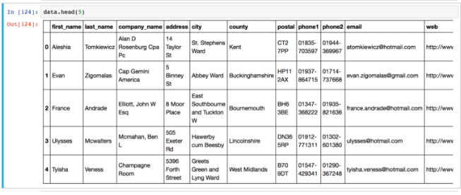
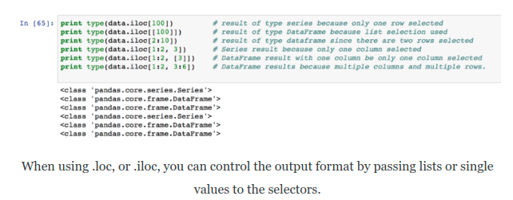

https://www.shanelynn.ie/select-pandas-dataframe-rows-and-columns-using-iloc-loc-and-ix/



There are multiple ways to select and index rows and columns from Pandas DataFrames.

#### 1. Selecting pandas data using “iloc”

The iloc indexer for Pandas Dataframe is used for integer-location based indexing / selection by position.

The iloc indexer syntax is data.iloc[<row selection>, <column selection>],

“iloc” in pandas is used to select rows and columns by number, in the order that they appear in the data frame. You can imagine that each row has a row number from 0 to the total rows (data.shape[0]) and iloc[] allows selections based on these numbers. The same applies for columns (ranging from 0 to data.shape[1] )

#### There are two “arguments” to iloc – a row selector, and a column selector. For example:

```python
# Single selections using iloc and DataFrame
# Rows:
data.iloc[0] # first row of data frame (Aleshia Tomkiewicz) - Note a Series data type output.
data.iloc[1] # second row of data frame (Evan Zigomalas)
data.iloc[-1] # last row of data frame (Mi Richan)
# Columns:
data.iloc[:,0] # first column of data frame (first_name)
data.iloc[:,1] # second column of data frame (last_name)
data.iloc[:,-1] # last column of data frame (id)

```

Multiple columns and rows can be selected together using the .iloc indexer.

```python
data.iloc[0:5] # first five rows of dataframe
data.iloc[:, 0:2] # first two columns of data frame with all rows
data.iloc[[0,3,6,24], [0,5,6]] # 1st, 4th, 7th, 25th row + 1st 6th 7th columns.
data.iloc[0:5, 5:8] # first 5 rows and 5th, 6th, 7th columns of data frame (county -> phone1).

```

There’s two gotchas to remember when using iloc in this manner:

1. Note that .iloc returns a Pandas Series when one row is selected, and a Pandas DataFrame when multiple rows are selected, or if any column in full is selected. To counter this, pass a single-valued list if you require DataFrame output.



2. When selecting multiple columns or multiple rows in this manner, remember that in your selection e.g.[1:5], the rows/columns selected will run from the first number to one minus the second number. e.g. [1:5] will go 1,2,3,4., [x,y] goes from x to y-1.
