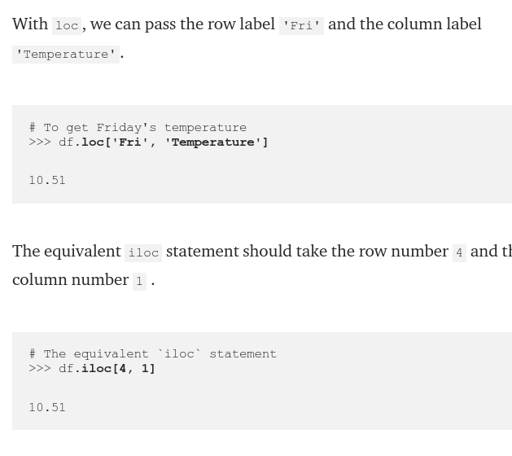
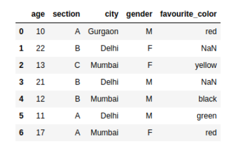
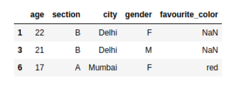

### Selecting via a single value

Both loc and iloc allow input to be a single value. We can use the following syntax for data selection:

```
loc[row_label, column_label]
iloc[row_position, column_position]

```

https://towardsdatascience.com/how-to-use-loc-and-iloc-for-selecting-data-in-pandas-bd09cb4c3d79




---

https://www.analyticsvidhya.com/blog/2020/02/loc-iloc-pandas/

**loc is label-based**, which means that we have to specify the name of the rows and columns that we need to filter out.

For example, let’s say we search for the rows whose index is 1, 2 or 100. We will not get the first, second or the hundredth row here. Instead, we will get the results only if the name of any index is 1, 2 or 100.

So, we can filter the data using the loc function in Pandas even if the indices are not an integer in our dataset.

**iloc is integer index-based.** So here, we have to specify rows and columns by their integer index.

Let’s say we search for the rows with index 1, 2 or 100. It will return the first, second and hundredth row, regardless of the name or labels we have in the index in our dataset.




### Select all rows with a condition with loc

```
data.loc[data.age >= 15]

```



---

### When we are using iloc,

Now we need to specify the rows and columns by their integer index. If we want to select only the first and third row, we simply need to put this into a list in the iloc statement with our dataframe:

```
data.iloc[[0,2]]
```


### Select a range of rows using iloc

```
data.iloc[1:3]

```

### Select a range of rows and columns using iloc

Slice the data frame over both rows and columns. In the below example, we selected the rows from (1-2) and columns from (2-3).

```
data.iloc[1:3,2:4]

```


---

https://towardsdatascience.com/how-to-use-loc-and-iloc-for-selecting-data-in-pandas-bd09cb4c3d79 - Exhaustive Blog

Below is summary

### loc is label based and allowed inputs are:
* A single label 'A' or 2 (Note that 2 is interpreted as a label of the index.)
* A list of labels ['A', 'B', 'C'] or [1, 2, 3] (Note that 1, 2, 3 are interpreted as labels of the index.)
* A slice with labels 'A':'C' (Both are included)
* Conditions, a boolean Series or a boolean array
* A callable function with one argument


### iloc is integer position based and allowed inputs are:

* An integer e.g. 2.
* A list or array of integers [1, 2, 3].
* A slice with integers 1:7(the endpoint 7 is excluded)
* Conditions, but only accept a boolean array
* A callable function with one argument
* loc and iloc are interchangeable when the labels of Pandas DataFrame are 0-based integers