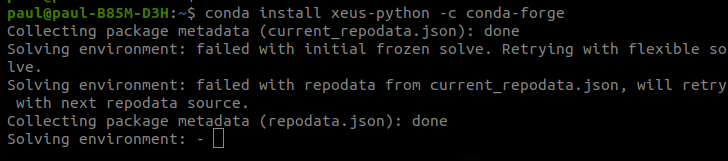

---


### Issue while installing

I first followed this - https://blog.jupyter.org/a-visual-debugger-for-jupyter-914e61716559

**That is without creating a new conda environment**


```
pip install xeus-python==0.7.1
pip install ptvsd
```

The debugger front-end can be installed as a JupyterLab extension. run:

`jupyter labextension install @jupyterlab/debugger`

In the back-end, a kernel implementing the Jupyter Debug Protocol (which will be detailed in the next section) is required. The only kernel implementing this protocol, for now, is xeus-python a new Jupyter kernel for the Python programming language. (Support for the debugger protocol in ipykernel is also on the roadmap).

`conda install xeus-python -c conda-forge`

The first time I ran the above in Ubuntu 20.04 - it was stuck for almost 15 minutes at the below screen (See below notes for details on this)



And then it gave output the 2 packages (**anaconda** and **python-language-s**) will be downgraded. Yes/No. So I chose NO. And now will be following the official guide to create a new conda environment to install the dependencies:

---

#### Reading

https://blog.jupyter.org/a-visual-debugger-for-jupyter-914e61716559

https://towardsdatascience.com/3-must-have-jupyterlab-2-0-extensions-41024fe455cc

https://github.com/jupyterlab/debugger

### What does conda do when “solving environment”

**[SO question](https://stackoverflow.com/questions/51753988/what-does-conda-do-when-solving-environment)**

Whenever I run `conda install/remove/update <package>`, it tells me it's "Solving environment" for some time before telling me the list of things it's going to download/install/update. Presumably it's looking for dependencies for `<package>`, but why does it sometimes _remove_ packages after doing this operation? For example, as I was trying to install Mayavi, it decided it needed to remove Anaconda Navigator.

Furthermore it does not provide an option to perform only a subset of the suggested operations. Is there a way to specify that I don't want a package removed?

**Ans -**

You can add `--debug` option to the conda command and see the output from console(or terminal). For example, type `conda update --debug numpy`.
From the output, we can see that the client requests `repodata.json` from channel list and do some computation locally in the `Solving Environment` Step.
