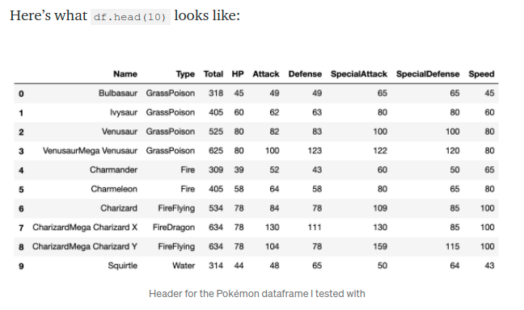
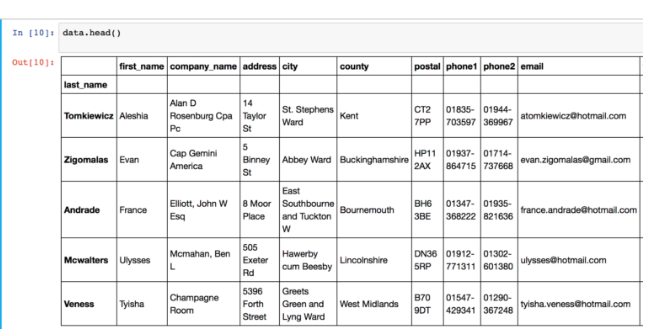
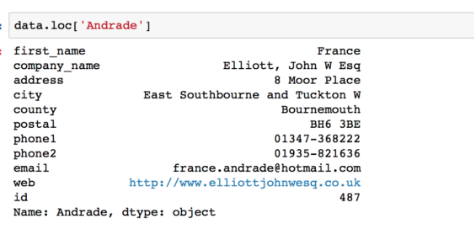
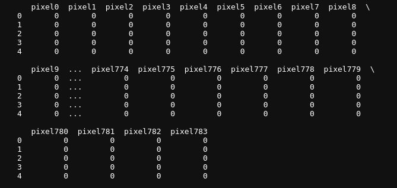
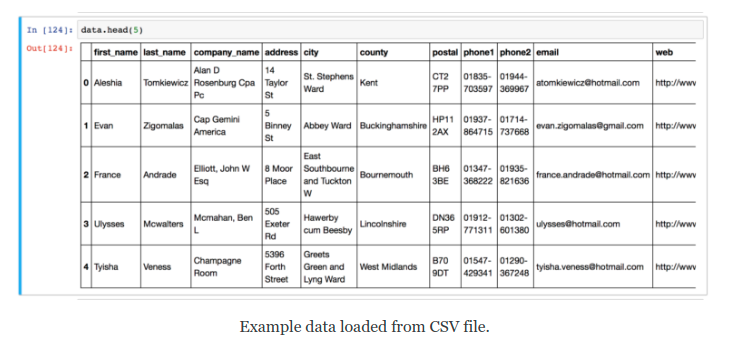
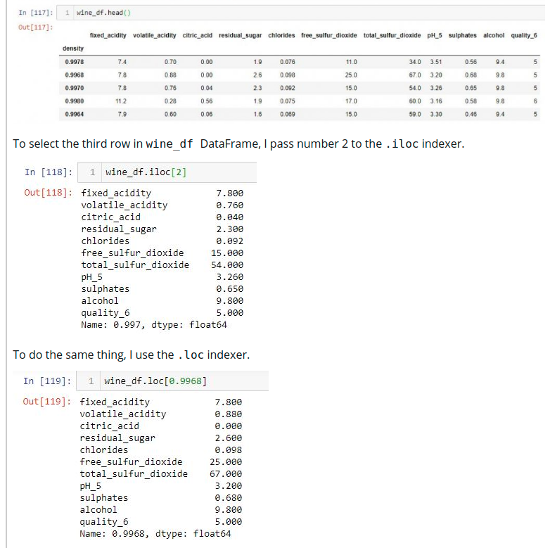

#### Good Examples

https://www.w3resource.com/pandas/dataframe/dataframe-loc.php

---

https://towardsdatascience.com/a-python-beginners-look-at-loc-part-1-cb1e1e565ec2

### Retrieving Data with .loc

.log finds Indexable Attribute and .log is Not a Method - .loc is not a dataframe method; uses [] instead of ().

#### Inside those square brackets, .loc takes two inputs: a row “indexer” and an (optional, separated by a comma) column “indexer”: no other arguments, like inplace or axis.

Some of the allowed inputs are:

A Single Label – returning the row as Series object.
A list of Labels – returns a DataFrame of selected rows.
A Slice with Labels – returns a Series with the specified rows, including start and stop labels.



```python

df.loc[4]

# will ouput

Name              Charmander
Type                    Fire
Total                    309
HP                        39
Attack                    52
Defense                   43
SpecialAttack             60
SpecialDefense            50
Speed                     65
Name: 4, dtype: object

```

All the row values on row number 4

#### loc will always interpret integers as labels, not as integer positions along the index (you can use .iloc for that).

---

https://www.shanelynn.ie/select-pandas-dataframe-rows-and-columns-using-iloc-loc-and-ix/#loc-selection





---

## Example with MNIST image dataset

The original dataframe is like this



So to pick all starting from pixel 0

#### Note the slice after the word 'pixel0'

```python
mnist_train_data = train_df_org.loc[:, "pixel0":]

print(mnist_train_data.shape) # (1000, 784)
```

And to pick only the column with column-heading as 'label'

```python

mnist_train_label = train_df_org.loc[:, "label"]

# print(mnist_train_label.shape) # (1000,)

```

https://www.shanelynn.ie/select-pandas-dataframe-rows-and-columns-using-iloc-loc-and-ix/#loc-selection



```python
# Select rows with index values 'Andrade' and 'Veness', with all columns between 'city' and 'email'

data.loc[['Andrade', 'Veness'], 'city':'email']

# Select same rows, with just 'first_name', 'address' and 'city' columns
data.loc['Andrade':'Veness', ['first_name', 'address', 'city']]
```

---

https://www.kdnuggets.com/2019/06/select-rows-columns-pandas.html

#### To select the third row in wine_df DataFrame, I pass number 2 to the .iloc indexer.

To do the same thing, I use the .loc indexer.


